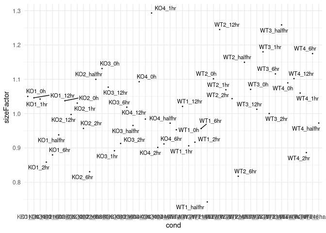

RNA-seq Data Analysis Pipeline
================
Md Musaddaqul Hasib
2022-12-23

## Loading Packages

``` r
library(org.Mm.eg.db)
```

    ## Loading required package: AnnotationDbi

    ## Loading required package: stats4

    ## Loading required package: BiocGenerics

    ## 
    ## Attaching package: 'BiocGenerics'

    ## The following objects are masked from 'package:stats':
    ## 
    ##     IQR, mad, sd, var, xtabs

    ## The following objects are masked from 'package:base':
    ## 
    ##     anyDuplicated, append, as.data.frame, basename, cbind, colnames,
    ##     dirname, do.call, duplicated, eval, evalq, Filter, Find, get, grep,
    ##     grepl, intersect, is.unsorted, lapply, Map, mapply, match, mget,
    ##     order, paste, pmax, pmax.int, pmin, pmin.int, Position, rank,
    ##     rbind, Reduce, rownames, sapply, setdiff, sort, table, tapply,
    ##     union, unique, unsplit, which.max, which.min

    ## Loading required package: Biobase

    ## Welcome to Bioconductor
    ## 
    ##     Vignettes contain introductory material; view with
    ##     'browseVignettes()'. To cite Bioconductor, see
    ##     'citation("Biobase")', and for packages 'citation("pkgname")'.

    ## Loading required package: IRanges

    ## Loading required package: S4Vectors

    ## 
    ## Attaching package: 'S4Vectors'

    ## The following objects are masked from 'package:base':
    ## 
    ##     expand.grid, I, unname

    ## 

``` r
library("DESeq2")
```

    ## Loading required package: GenomicRanges

    ## Loading required package: GenomeInfoDb

    ## Loading required package: SummarizedExperiment

    ## Loading required package: MatrixGenerics

    ## Loading required package: matrixStats

    ## 
    ## Attaching package: 'matrixStats'

    ## The following objects are masked from 'package:Biobase':
    ## 
    ##     anyMissing, rowMedians

    ## 
    ## Attaching package: 'MatrixGenerics'

    ## The following objects are masked from 'package:matrixStats':
    ## 
    ##     colAlls, colAnyNAs, colAnys, colAvgsPerRowSet, colCollapse,
    ##     colCounts, colCummaxs, colCummins, colCumprods, colCumsums,
    ##     colDiffs, colIQRDiffs, colIQRs, colLogSumExps, colMadDiffs,
    ##     colMads, colMaxs, colMeans2, colMedians, colMins, colOrderStats,
    ##     colProds, colQuantiles, colRanges, colRanks, colSdDiffs, colSds,
    ##     colSums2, colTabulates, colVarDiffs, colVars, colWeightedMads,
    ##     colWeightedMeans, colWeightedMedians, colWeightedSds,
    ##     colWeightedVars, rowAlls, rowAnyNAs, rowAnys, rowAvgsPerColSet,
    ##     rowCollapse, rowCounts, rowCummaxs, rowCummins, rowCumprods,
    ##     rowCumsums, rowDiffs, rowIQRDiffs, rowIQRs, rowLogSumExps,
    ##     rowMadDiffs, rowMads, rowMaxs, rowMeans2, rowMedians, rowMins,
    ##     rowOrderStats, rowProds, rowQuantiles, rowRanges, rowRanks,
    ##     rowSdDiffs, rowSds, rowSums2, rowTabulates, rowVarDiffs, rowVars,
    ##     rowWeightedMads, rowWeightedMeans, rowWeightedMedians,
    ##     rowWeightedSds, rowWeightedVars

    ## The following object is masked from 'package:Biobase':
    ## 
    ##     rowMedians

``` r
library("genefilter")
```

    ## 
    ## Attaching package: 'genefilter'

    ## The following objects are masked from 'package:MatrixGenerics':
    ## 
    ##     rowSds, rowVars

    ## The following objects are masked from 'package:matrixStats':
    ## 
    ##     rowSds, rowVars

``` r
library(ggrepel)
```

    ## Loading required package: ggplot2

``` r
library(data.table)
```

    ## 
    ## Attaching package: 'data.table'

    ## The following object is masked from 'package:SummarizedExperiment':
    ## 
    ##     shift

    ## The following object is masked from 'package:GenomicRanges':
    ## 
    ##     shift

    ## The following object is masked from 'package:IRanges':
    ## 
    ##     shift

    ## The following objects are masked from 'package:S4Vectors':
    ## 
    ##     first, second

``` r
library("dplyr")
```

    ## 
    ## Attaching package: 'dplyr'

    ## The following objects are masked from 'package:data.table':
    ## 
    ##     between, first, last

    ## The following object is masked from 'package:matrixStats':
    ## 
    ##     count

    ## The following objects are masked from 'package:GenomicRanges':
    ## 
    ##     intersect, setdiff, union

    ## The following object is masked from 'package:GenomeInfoDb':
    ## 
    ##     intersect

    ## The following object is masked from 'package:AnnotationDbi':
    ## 
    ##     select

    ## The following objects are masked from 'package:IRanges':
    ## 
    ##     collapse, desc, intersect, setdiff, slice, union

    ## The following objects are masked from 'package:S4Vectors':
    ## 
    ##     first, intersect, rename, setdiff, setequal, union

    ## The following object is masked from 'package:Biobase':
    ## 
    ##     combine

    ## The following objects are masked from 'package:BiocGenerics':
    ## 
    ##     combine, intersect, setdiff, union

    ## The following objects are masked from 'package:stats':
    ## 
    ##     filter, lag

    ## The following objects are masked from 'package:base':
    ## 
    ##     intersect, setdiff, setequal, union

``` r
library("ggplot2")
```

## Data directory

``` r
data <- load('/ihome/yufeihuang/zhl169/timothy/Gao_mouse_CASTOR1/feature_counts.RData')
```

## Loading Dataset

``` r
counts_KO <- count_matrix_KO$counts
counts_WT <- count_matrix_WT$counts
count_matrix <- cbind(counts_KO, counts_WT)
```

## What is in count matrix?

``` r
dim(count_matrix)
```

    ## [1] 55414    48

``` r
head(rownames(count_matrix))
```

    ## [1] "ENSMUSG00000102693.2" "ENSMUSG00000064842.3" "ENSMUSG00000051951.6"
    ## [4] "ENSMUSG00000102851.2" "ENSMUSG00000103377.2" "ENSMUSG00000104017.2"

``` r
head(colnames(count_matrix))
```

    ## [1] "C1-KO1-0_S7.sorted.bam"          "C1-KO1-LPS-12hr_S12.sorted.bam" 
    ## [3] "C1-KO1-LPS-1hr_S9.sorted.bam"    "C1-KO1-LPS-2hr_S10.sorted.bam"  
    ## [5] "C1-KO1-LPS-6hr_S11.sorted.bam"   "C1-KO1-LPS-halfhr_S8.sorted.bam"

we have 55414 genes 48 samples

# Mapping genes from Ensemble to Gene name

``` r
genes <- rownames(count_matrix)
genes <- sapply(strsplit(genes, ".",fixed = TRUE), function(x) x[1])
mapped_id <- mapIds(org.Mm.eg.db,keys = genes,column = 'SYMBOL',keytype = 'ENSEMBL')
```

    ## 'select()' returned 1:many mapping between keys and columns

``` r
na_index <- is.na(mapped_id)
rownames(count_matrix) <- mapped_id
head(rownames(count_matrix))
```

    ## ENSMUSG00000102693 ENSMUSG00000064842 ENSMUSG00000051951 ENSMUSG00000102851 
    ##                 NA          "Gm26206"             "Xkr4"          "Gm18956" 
    ## ENSMUSG00000103377 ENSMUSG00000104017 
    ##                 NA                 NA

``` r
head(colnames(count_matrix))
```

    ## [1] "C1-KO1-0_S7.sorted.bam"          "C1-KO1-LPS-12hr_S12.sorted.bam" 
    ## [3] "C1-KO1-LPS-1hr_S9.sorted.bam"    "C1-KO1-LPS-2hr_S10.sorted.bam"  
    ## [5] "C1-KO1-LPS-6hr_S11.sorted.bam"   "C1-KO1-LPS-halfhr_S8.sorted.bam"

Now we need to genes that could not be mapped

# Convert count matrix to a data frame

Before doing that we can trim our samples names for conveiniece.

``` r
#count_matrix <- count_matrix[!na_index,]
colnames(count_matrix) <- sapply(strsplit(colnames(count_matrix), ".",fixed = TRUE), function(x) x[1])
count_matrix <- as.data.frame(count_matrix)
head(count_matrix)
```

    ##         C1-KO1-0_S7 C1-KO1-LPS-12hr_S12 C1-KO1-LPS-1hr_S9 C1-KO1-LPS-2hr_S10
    ## NA.               0                   0                 0                  0
    ## Gm26206           0                   0                 0                  0
    ## Xkr4             20                  30                26                 21
    ## Gm18956           0                   0                 0                  0
    ## NA..1             0                   1                 0                  0
    ## NA..2             0                   0                 0                  0
    ##         C1-KO1-LPS-6hr_S11 C1-KO1-LPS-halfhr_S8 C1-KO2-0_S19
    ## NA.                      0                    0            0
    ## Gm26206                  0                    0            0
    ## Xkr4                    43                   20           16
    ## Gm18956                  0                    0            0
    ## NA..1                    0                    0            0
    ## NA..2                    0                    0            0
    ##         C1-KO2-LPS-12hr_S24 C1-KO2-LPS-1hr_S21 C1-KO2-LPS-2hr_S22
    ## NA.                       0                  0                  0
    ## Gm26206                   0                  0                  0
    ## Xkr4                     16                 28                 29
    ## Gm18956                   0                  0                  0
    ## NA..1                     0                  0                  0
    ## NA..2                     0                  0                  0
    ##         C1-KO2-LPS-6hr_S23 C1-KO2-LPS-halfhr_S20 C1-KO3-0_S31
    ## NA.                      0                     0            0
    ## Gm26206                  0                     0            0
    ## Xkr4                    20                    24           18
    ## Gm18956                  0                     0            0
    ## NA..1                    0                     0            0
    ## NA..2                    0                     0            0
    ##         C1-KO3-LPS-12hr_S36 C1-KO3-LPS-1hr_S33 C1-KO3-LPS-2hr_S34
    ## NA.                       0                  0                  0
    ## Gm26206                   0                  0                  0
    ## Xkr4                     31                 27                 23
    ## Gm18956                   0                  0                  0
    ## NA..1                     0                  0                  0
    ## NA..2                     0                  0                  0
    ##         C1-KO3-LPS-6hr_S35 C1-KO3-LPS-halfhr_S32 C1-KO4-0_S43
    ## NA.                      0                     0            0
    ## Gm26206                  0                     0            0
    ## Xkr4                    37                    15           24
    ## Gm18956                  0                     0            0
    ## NA..1                    0                     0            0
    ## NA..2                    1                     0            0
    ##         C1-KO4-LPS-12hr_S48 C1-KO4-LPS-1hr_S45 C1-KO4-LPS-2hr_S46
    ## NA.                       0                  0                  0
    ## Gm26206                   0                  0                  0
    ## Xkr4                     15                 43                 18
    ## Gm18956                   0                  0                  0
    ## NA..1                     0                  0                  0
    ## NA..2                     0                  0                  0
    ##         C1-KO4-LPS-6hr_S47 C1-KO4-LPS-halfhr_S44 C1-WT1-0_S1 C1-WT1-LPS-12hr_S6
    ## NA.                      0                     0           0                  0
    ## Gm26206                  0                     0           0                  0
    ## Xkr4                    24                    19          27                 28
    ## Gm18956                  0                     0           0                  0
    ## NA..1                    0                     0           0                  0
    ## NA..2                    0                     0           0                  1
    ##         C1-WT1-LPS-1hr_S3 C1-WT1-LPS-2hr_S4 C1-WT1-LPS-6hr_S5
    ## NA.                     0                 0                 0
    ## Gm26206                 0                 0                 0
    ## Xkr4                  102                63                43
    ## Gm18956                 0                 0                 1
    ## NA..1                   0                 0                 0
    ## NA..2                   0                 0                 0
    ##         C1-WT1-LPS-halfhr_S2 C1-WT2-0_S13 C1-WT2-LPS-12hr_S18
    ## NA.                        0            0                   0
    ## Gm26206                    0            0                   0
    ## Xkr4                      53           20                  48
    ## Gm18956                    0            0                   0
    ## NA..1                      0            0                   0
    ## NA..2                      0            0                   0
    ##         C1-WT2-LPS-1hr_S15 C1-WT2-LPS-2hr_S16 C1-WT2-LPS-6hr_S17
    ## NA.                      0                  0                  0
    ## Gm26206                  0                  0                  0
    ## Xkr4                    49                 55                 50
    ## Gm18956                  0                  0                  0
    ## NA..1                    0                  0                  0
    ## NA..2                    2                  0                  0
    ##         C1-WT2-LPS-halfhr_S14 C1-WT3-0_S25 C1-WT3-LPS-12hr_S30
    ## NA.                         0            0                   0
    ## Gm26206                     0            0                   0
    ## Xkr4                       42           29                  28
    ## Gm18956                     0            0                   0
    ## NA..1                       0            0                   0
    ## NA..2                       0            0                   0
    ##         C1-WT3-LPS-1hr_S27 C1-WT3-LPS-2hr_S28 C1-WT3-LPS-6hr_S29
    ## NA.                      0                  0                  0
    ## Gm26206                  0                  0                  0
    ## Xkr4                    43                 41                 78
    ## Gm18956                  0                  0                  0
    ## NA..1                    1                  0                  0
    ## NA..2                    0                  0                  0
    ##         C1-WT3-LPS-halfhr_S26 C1-WT4-0_S37 C1-WT4-LPS-12hr_S42
    ## NA.                         0            0                   0
    ## Gm26206                     0            0                   0
    ## Xkr4                       13           26                  33
    ## Gm18956                     0            0                   0
    ## NA..1                       0            0                   0
    ## NA..2                       0            0                   0
    ##         C1-WT4-LPS-1hr_S39 C1-WT4-LPS-2hr_S40 C1-WT4-LPS-6hr_S41
    ## NA.                      0                  0                  0
    ## Gm26206                  0                  0                  0
    ## Xkr4                    39                 26                 25
    ## Gm18956                  0                  0                  0
    ## NA..1                    0                  0                  0
    ## NA..2                    0                  0                  0
    ##         C1-WT4-LPS-halfhr_S38
    ## NA.                         0
    ## Gm26206                     0
    ## Xkr4                       32
    ## Gm18956                     0
    ## NA..1                       0
    ## NA..2                       0

## DESeqDataSet object

### Design formula

The simplest design formula for differential expression would be \~
condition, where condition is a column in colData(dds) that specifies
which of two (or more groups) the samples belong to.

``` r
cond <- sapply(strsplit(colnames(count_matrix), "_",fixed = TRUE), function(x) x[1])
cond <- sapply(strsplit(cond, "-",fixed = TRUE), function(x) x[2:4])
cond[is.na(cond)] <- '0h'
treatment <- cond[1,]
time <- cond[3,]
cond <- paste0(cond[1,],'_',cond[3,])
colData <- data.frame(row.names=colnames(count_matrix), cond,treatment,time)
head(colData)
```

    ##                            cond treatment   time
    ## C1-KO1-0_S7              KO1_0h       KO1     0h
    ## C1-KO1-LPS-12hr_S12    KO1_12hr       KO1   12hr
    ## C1-KO1-LPS-1hr_S9       KO1_1hr       KO1    1hr
    ## C1-KO1-LPS-2hr_S10      KO1_2hr       KO1    2hr
    ## C1-KO1-LPS-6hr_S11      KO1_6hr       KO1    6hr
    ## C1-KO1-LPS-halfhr_S8 KO1_halfhr       KO1 halfhr

count_matrix: a table with the fragment counts coldata: a table with
information about the sample

### DEseq dataset object from the matrix of counts and the sample information table

If the research aim is to determine for which genes the effect of
treatment is different across groups, then interaction terms can be
included and tested using a design such as \~ group + treatment +
group:treatment.

``` r
dds <- DESeqDataSetFromMatrix(count_matrix, colData, ~ treatment)
```

    ## Warning in DESeqDataSet(se, design = design, ignoreRank): some variables in
    ## design formula are characters, converting to factors

``` r
print(dds)
```

    ## class: DESeqDataSet 
    ## dim: 55414 48 
    ## metadata(1): version
    ## assays(1): counts
    ## rownames(55414): NA. Gm26206 ... NA..22537 NA..22538
    ## rowData names(0):
    ## colnames(48): C1-KO1-0_S7 C1-KO1-LPS-12hr_S12 ... C1-WT4-LPS-6hr_S41
    ##   C1-WT4-LPS-halfhr_S38
    ## colData names(3): cond treatment time

### 32875 genes before filtering

``` r
nrow(dds)
```

    ## [1] 55414

``` r
dds <- dds[ rowSums(counts(dds)) > 1, ]
nrow(dds)
```

    ## [1] 36138

### 24067 genes after filtering

### Testing suitable transformation choice to stabilize variance and mean.

### rlog and vst

``` r
rld <- rlog(dds, blind = FALSE)
```

    ## rlog() may take a few minutes with 30 or more samples,
    ## vst() is a much faster transformation

``` r
vsd <- vst(dds, blind = FALSE)
```

``` r
dds <- estimateSizeFactors(dds)
colData$sizeFactor <- dds$sizeFactor
```

### plot size factor per sample

We are going to use ggplot

``` r
ggplot(data=colData, aes(x=cond, y=sizeFactor, cond = time)) + geom_point(size = 0.3)+ theme_minimal() +
  geom_text_repel(aes(label = cond), size = 3, show.legend = FALSE)
```

<!-- -->
